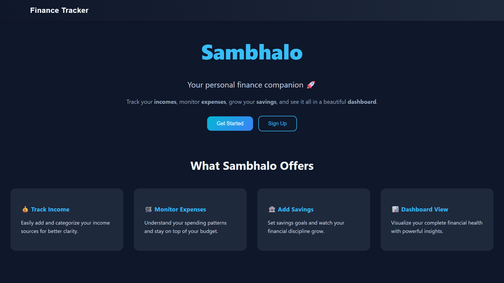
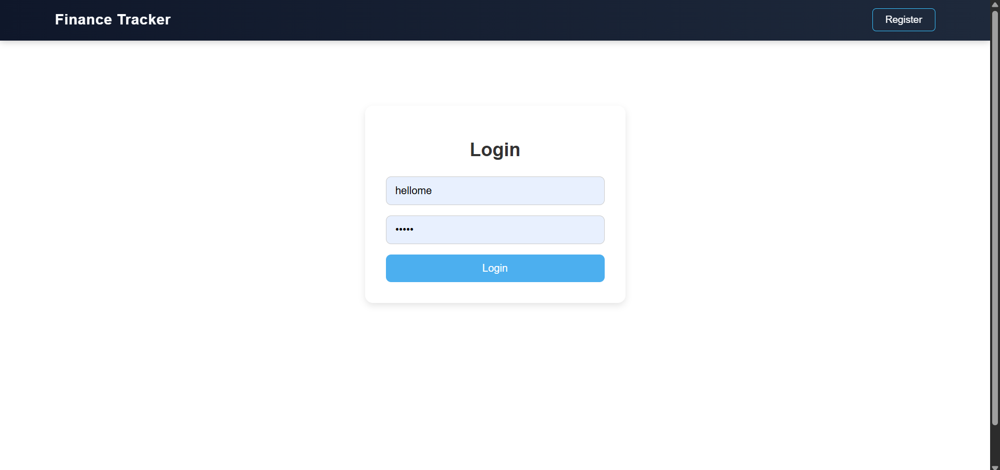
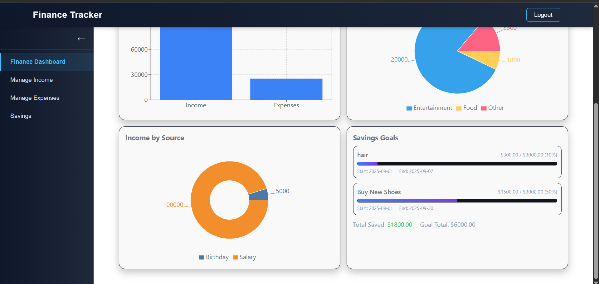
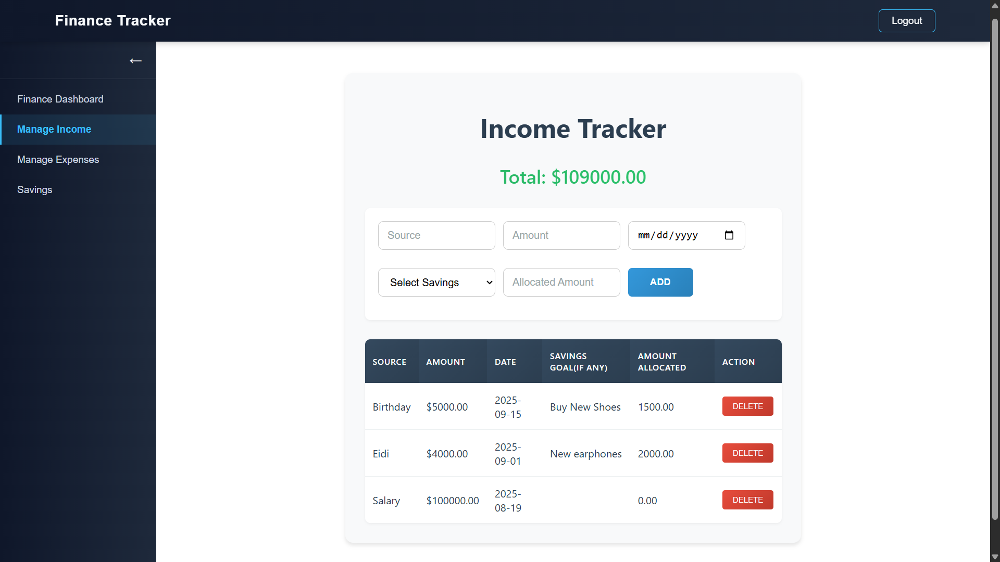
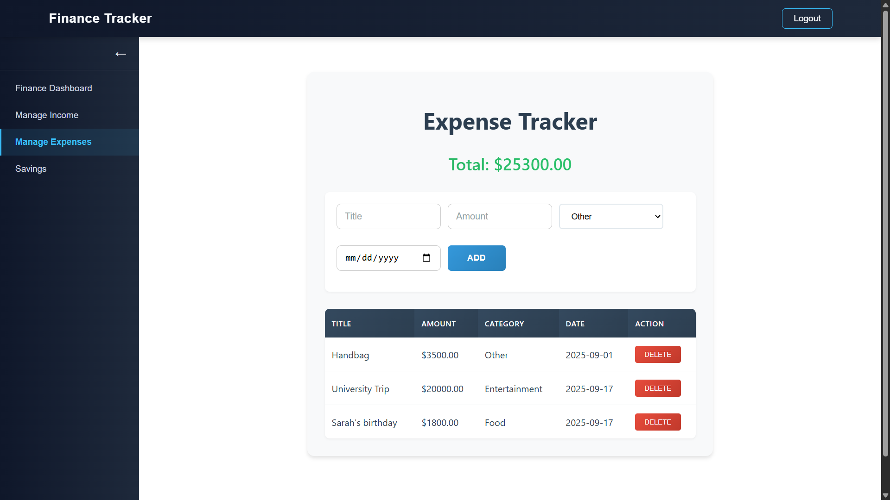
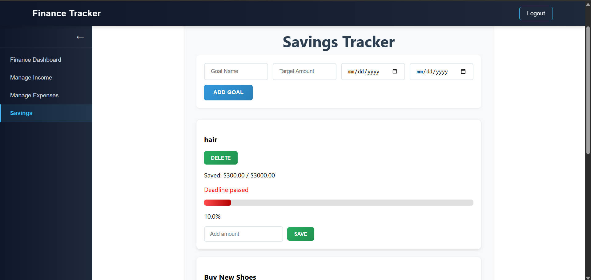
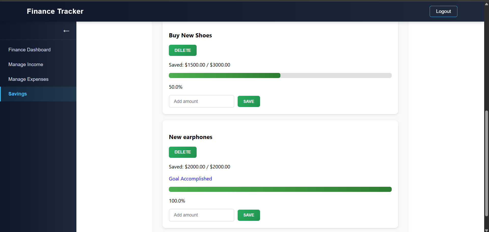

# 💰Sambhalo - Personal Finance Tracker

   

Sambhalo is a **full-stack Finance Tracker** app to manage your personal finances efficiently.  
Built with **Django, Python & SQLite** for the backend and **React + Vite + CSS** for the frontend.  
Features **JWT authentication**, dashboards, and charts to track your **income, expenses, and savings**.

---

## ✨ Features

### 🔐 Authentication
- Register & login securely using **JWT tokens**.

### 🗂️ Sidebar Navigation
- **Finance Dashboard**  
- **Manage Income**  
- **Manage Expenses**  
- **Manage Savings**

### 📊 Finance Dashboard
Get a **complete overview of your finances** at a glance:  
- 💵 **Total Income** – see all your income combined  
- 🛒 **Total Expenses** – track your spending  
- 💰 **Net Balance** – remaining balance after expenses  
- 📈 **Savings Rate** – percentage of income saved  
- 📊 **Charts & Analytics:**  
  - **Income vs Expenses** – bar chart comparison  
  - **Expenses by Category** – pie chart breakdown  
  - **Income by Source** – donut chart visualization  
- 🎯 **Savings Goals** – view progress, start & end date, and deadline status  

### 💸 Manage Income
Easily **add and track your income**:  
- 📝 Add income with **name, amount, date**  
- 🎯 Optionally **allocate part of income** to a savings goal  

### 🛒 Manage Expenses
Track your spending effortlessly:  
- 📝 Add expense with **name, amount, category (Food, Entertainment, etc.), and date**  
- 📊 Analyze expense patterns by category  

### 🏦 Manage Savings
Plan and achieve your financial goals:  
- 🏷️ Create saving goals with **name, target amount, start & end date**  
- ✅ Track **progress** and see which goals are **accomplished**  
- ⚠️ Goals past deadline are **highlighted in red**
---

## 🛠️ Technologies Used

**Backend:** Django, Python, SQLite, Django REST Framework, JWT Authentication  
**Frontend:** React, JavaScript (ES6+), CSS, Vite

### 🏠 Screenshots

<table>
  <tr>
    <td align="center">
      <b>Sambhalo Home</b> 
      
    </td>
    <td align="center">
      <b>Login Page</b> 
      
    </td>
  </tr>
  <tr>
    <td align="center">
      <b>Finance Dashboard 1</b> 
      
    </td>
    <td align="center">
      <b>Finance Dashboard 2</b> 
      
    </td>
  </tr>
  <tr>
    <td align="center">
      <b>Income Tracker</b> 
      
    </td>
    <td align="center">
      <b>Expense Tracker</b> 
      
    </td>
  </tr>
  <tr>
    <td align="center">
      <b>Savings Tracker 1</b> 
      
    </td>
    <td align="center">
      <b>Savings Tracker 2</b> 
      
    </td>
  </tr>
</table>
